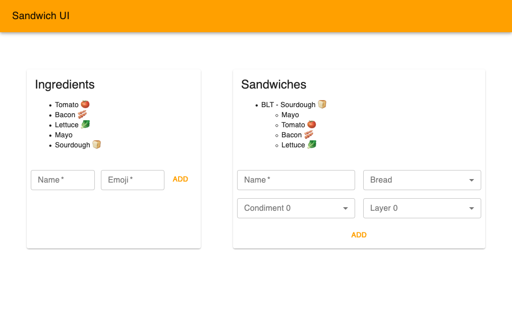

<h1 align="center">
<!-- Logo Credit: https://www.iconfinder.com/icons/1760341/chip_potato_chip_snack_icon
 -->

</h1>

<div align="center">
  <h3><code>chip</code></h3>
</div>
<div align="center">
   Easily manage microservices and infrastructure for local development 
</div>

## Installation

Run the following command to install `chip` from NPM:

```
yarn global add @qdivision/chip
```

You can update your installation by running:

```
yarn global upgrade @qdivision/chip
```

## Usage

All subcommands supported by `chip` can be viewed by running `chip help`:

```
chip <command>

Commands:
  chip sync [services|tags..]               Clone or pull repos for services in
                                            project
  chip checkout <branch> [services|tags..]  Checkout a git branch for services in
                                            project
  chip status [services|tags..]             Show git status for services in project
  chip install [services|tags..]            Install dependencies for services in
                                            project
  chip start [services|tags..]              Start services in project
  chip stop [services|tags..]               Stop services in project
  chip restart [services|tags..]            Stop and restart services in project
  chip logs [services|tags..]               View logs for services in project
  chip list                                 List all services in project
```

## Sample Project

The [`sandwich`](https://github.com/QDivision/sandwich) repo is a sample project that demonstrates how to setup a project to work with `chip`. It contains PostgreSQL databases, a RabbitMQ broker, a React app, as well as backend services written in Java, Kotlin, and Node.



## Sample `chip.yml`

```yml
# Runs at start of every `install` and `run` subprocess
setup: |
  export sdkman_auto_answer=true
  source "$HOME/.sdkman/bin/sdkman-init.sh"
  export NVM_DIR="$HOME/.nvm"
  if [ -f "$NVM_DIR/nvm.sh" ]; then
      . "$NVM_DIR/nvm.sh"
  else
      . "/usr/local/opt/nvm/nvm.sh"
  fi

# Runs before `install` subprocesses for services
install: |
  echo 'no' | sdk install java 11.0.2-open
  nvm install 10.16.3

# Runs at start of every service-level `install` and `run` subprocess,
# after `setup`
setup-service: |
  sdk use java 11.0.2-open
  nvm use 10.16.3

services:
  sandwich-ui:
    repo: 'git@github.com:QDivision/sandwich-ui.git'
    install: 'yarn install'
    run: 'yarn start'
    tags:
      - sandwich

  sandwich-api:
    repo: 'git@github.com:QDivision/sandwich-api.git'
    install: 'mvn clean package -D maven.test.skip=true'
    run: 'mvn spring-boot:run -D spring-boot.run.profiles=local'
    tags:
      - sandwich

  ingredient-api:
    repo: 'git@github.com:QDivision/ingredient-api.git'
    install: 'mvn clean package -D maven.test.skip=true'
    run: 'mvn spring-boot:run -D spring-boot.run.profiles=local'

  emoji-api:
    repo: 'git@github.com:QDivision/emoji-api.git'
    install: 'yarn install'
    run: 'yarn start'
```

## Sample `secretchip.yml`

**WARNING:** The `secretchip.yml` file should not be committed to Git! Please be sure to add it to your `.gitignore`!

```yml
services:
  sandwich-api:
    SPRING_DATASOURCE_USERNAME: sandwichadmin
    SPRING_DATASOURCE_PASSWORD: sandwichadmin
    SPRING_LIQUIBASE_USER: sandwichadmin
    SPRING_LIQUIBASE_PASSWORD: sandwichadmin
    SPRING_RABBITMQ_USERNAME: wabbit
    SPRING_RABBITMQ_PASSWORD: wabbit

  ingredient-api:
    SPRING_DATASOURCE_USERNAME: ingredientadmin
    SPRING_DATASOURCE_PASSWORD: ingredientadmin
    SPRING_LIQUIBASE_USER: ingredientadmin
    SPRING_LIQUIBASE_PASSWORD: ingredientadmin
    SPRING_RABBITMQ_USERNAME: wabbit
    SPRING_RABBITMQ_PASSWORD: wabbit

  emoji-api:
    DB_USERNAME: emojiadmin
    DB_PASSWORD: emojiadmin
```

## Development Installation

Run the following commands to clone the `chip` source code and set it up for development it on your machine.

```
git clone git@github.com:QDivision/chip.git
cd chip
yarn install
yarn build
yarn link
chip help
```

Note that you must run `yarn build` each time you make a change to the `.ts` source files in order for it to be picked up when you run `chip`.

If you are actively making changes to the source code you can run `yarn buildw` to start a process that will automatically detect changes to the source files and recompile the project for you. This is the fastest and easiest way to develop `chip`.

If chip was initially installed through Yarn and you want to switch to a development installation, you should run the following commands.

```
cd chip
yarn global remove @qdivision/chip
yarn unlink
yarn link
```
